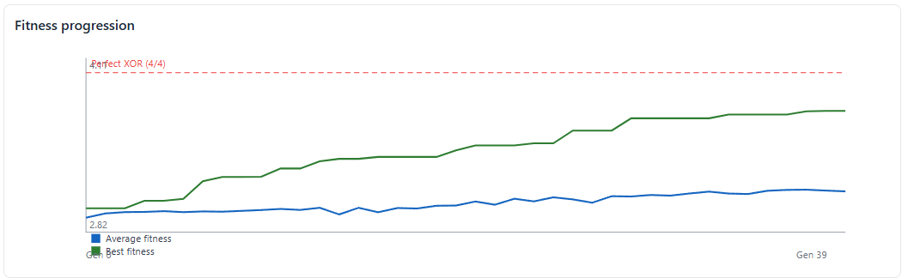
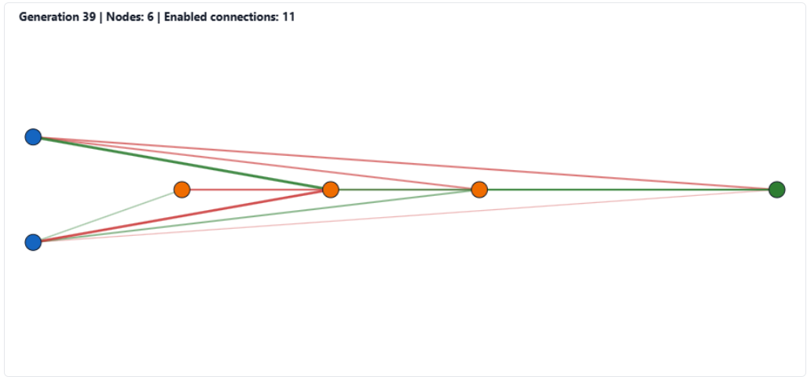
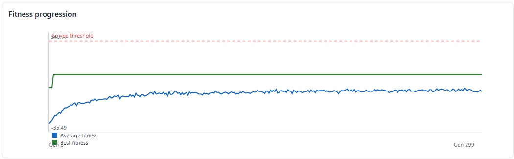
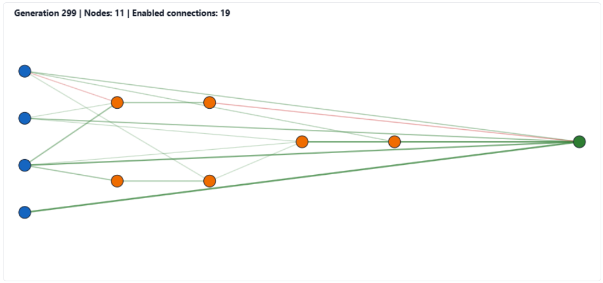
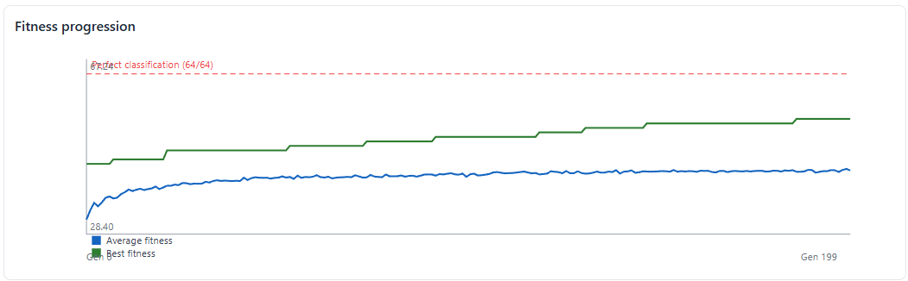
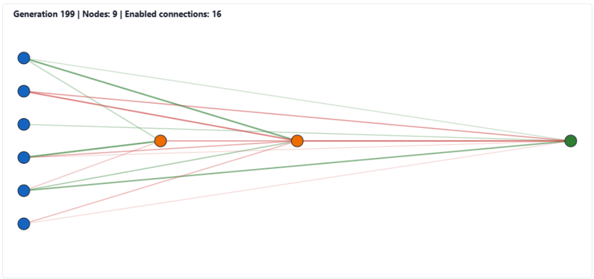

# DotNeat

DotNeat is a from-scratch NEAT (NeuroEvolution of Augmenting Topologies) implementation in modern C# / .NET.

[](https://github.com/adamstirtan/DotNeat/actions/workflows/ci.yaml)

It is designed for:

- learning how NEAT works internally,
- experimenting with mutation/speciation/reproduction strategies,
- teaching neuroevolution concepts with concrete visual outputs.

## What the library currently supports

Core NEAT pipeline features implemented in `DotNeat`:

- `Genome` representation (`NodeGene`, `ConnectionGene`) with validation
- `NeuralNetwork` phenotype build from genome (topological sort + forward pass)
- Mutation operators:
  - weight perturb/reset
  - add connection
  - add node (split enabled connection)
  - enable/disable toggling (cycle-safe)
- Crossover:
  - innovation-number matching
  - disjoint/excess handling
  - fitter-parent bias
- Speciation:
  - compatibility distance (`c1*excess + c2*disjoint + c3*avgWeightDiff`)
  - grouping into species
  - explicit fitness sharing
- Reproduction pipeline:
  - within-species selection
  - elitism
  - offspring allocation by adjusted fitness
  - crossover/mutation probabilities
- Generation orchestration:
  - initialize -> evaluate -> speciate -> reproduce -> next generation
  - generation metrics history (best fitness, average fitness, species count, complexity)
  - optional per-generation callbacks for logging/snapshots
- Parallelized population fitness evaluation in the orchestrator

## Runner experiments

`DotNeat.Runner` currently includes:

- `xor` — classic XOR benchmark
- `cartpole` — single-pole balancing benchmark
- `mux6` (alias: `multiplexer`) — 6-bit multiplexer benchmark

## Visualizations

Each experiment run generates:

- `history.csv`
- `report.html` with:
  - fitness progression charts
  - species and complexity charts
  - optional task-specific chart(s)
  - **champion network snapshots** (canvas drawings over selected generations)

Output path is stable regardless of working directory:

`artifacts/visualizations/<experiment>/<timestamp-seed>/report.html`

## Quick start

From repository root:

```bash
dotnet build
dotnet run --project DotNeat.Runner -- xor 31337
dotnet run --project DotNeat.Runner -- cartpole 12345
dotnet run --project DotNeat.Runner -- mux6 12345
```

## Recent sample runs (latest local code)

The following runs were executed against the latest code in this repository:

| Experiment |  Seed | Final best fitness | Notes                                                     |
| ---------- | ----: | -----------------: | --------------------------------------------------------- |
| XOR        | 31337 |     3.670531 / 4.0 | Steady improvement, not fully solved in 40 generations    |
| XOR        | 12345 |     3.718018 / 4.0 | Similar trend, higher final fitness                       |
| MUX-6      | 12345 |            54 / 64 | Complex benchmark, partial solution after 200 generations |
| CartPole   | 12345 |             301.60 | ~300.6 average champion steps survived, not solved to 500 |

Generated reports for those runs are under:

- `artifacts/visualizations/xor/20260304-151150-seed31337/report.html`
- `artifacts/visualizations/xor/20260304-151155-seed12345/report.html`
- `artifacts/visualizations/mux6/20260304-151247-seed12345/report.html`
- `artifacts/visualizations/cartpole/20260304-151411-seed12345/report.html`

## Example evolved networks

### XOR




### CartPole




### MUX-6




## Teaching/demo notes

Good things to point out while presenting:

1. **Fitness vs average fitness**: are we improving one champion or the whole population?
2. **Species count trend**: are innovations being protected?
3. **Complexity trend**: structural growth over time (the "AT" in NEAT).
4. **Network snapshots**: topology evolution from simple initial graphs to task-adapted structures.
